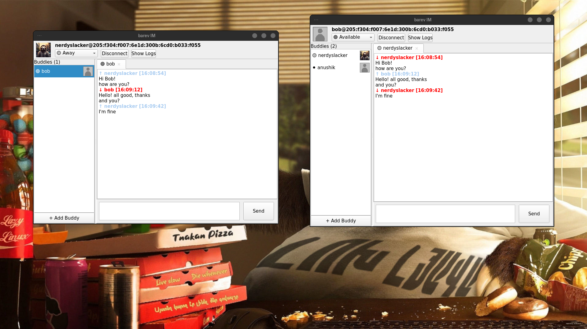

<div align="center">
<a href="https://github.com/nerdyslacker/barev-im"></a>
</div>
<h1 align="center">Barev IM [ընկեր]</h1>

<div align="center">

[](https://github.com/nerdyslacker/barev-im/blob/main/LICENSE)
[](https://github.com/nerdyslacker/barev-im/releases)

[](https://github.com/nerdyslacker/barev-im/stargazers)
[](https://github.com/nerdyslacker/barev-im/fork)

<strong>A graphical user interface for the Barev protocol built on top of the barev-pascal library. (Trying to learn Pascal :D)</strong>

</div>

## Demo

https://github.com/user-attachments/assets/d9de5b59-ab5b-4d9a-a85c-a9dde32503db

## Requirements

- Lazarus IDE (or Free Pascal Compiler with LCL)
- barev-pascal library (https://github.com/norayr/barev-pascal)
- Yggdrasil network connection

### Getting Started

1. **Enter Your Details**
   - Fill in your nickname in the "My Nick" field
   - Enter your Yggdrasil IPv6 address in the "My IPv6" field
   - Set your listening port in the "My Port" field (default: 5299)
     - If running multiple instances on the same machine, use different ports (e.g., 5299, 5300)
     - If running in separate Docker containers, all can use 5299
   - Click "Connect" to start the client

2. **Add Buddies**
   - Click "Add Buddy" button
   - Enter buddy's nickname
   - Enter buddy's IPv6 address
   - Enter buddy's port (default: 5299)
   - The buddy will appear in the buddy list

3. **Remove Buddies**
   - Select a buddy from the list
   - Click "Remove Buddy" button
   - Confirm deletion
   - Buddy will be removed from list and saved configuration

4. **Start Chatting**
   - Double-click a buddy in the buddy list to connect
   - Type your message in the text field at the bottom
   - Press Enter or click "Send" to send the message
   - Messages appear in the chat window with timestamps

<picture>
    
</picture>

## Configuration and Persistence

The application automatically saves your settings to a configuration file:

**Linux/Unix**: `~/.barev/barev.ini`

### Configuration File Format

```ini
[User]
Nick=nerdyslacker
IPv6=201:87ec:4df2:51d4:7fdd:d63c:95e4:ed6e
Port=5299
AvatarPath=

[Window]
AutoConnect=0

[Contact-0]
Nick=bob
IPv6=0201:87EC:4DF2:51D4:7FDD:D63C:95E4:ED6E
Port=5300
AvatarPath=

```

## Building

### Using Lazarus IDE

1. Open Lazarus IDE
2. Open the project file: `File -> Open -> barevim.lpr`
3. Add the Barev units to your project search path:
   - `Project -> Project Options -> Compiler Options -> Paths`
   - Add the path to the Barev library units
4. Build: `Run -> Build` (or press Shift+F9)
5. Run: `Run -> Run` (or press F9)

### Using Command Line

```bash
# Make sure the Barev units are in your unit search path
lazbuild barevim.lpr

# Or with fpc directly
fpc -Fu/path/to/barev/units barevim.lpr
```

## Credits

[Norayr Chilingarian](https://github.com/norayr)
